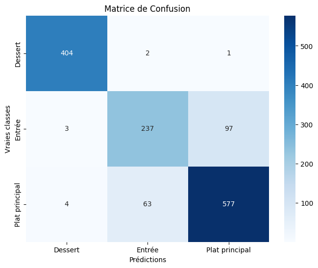
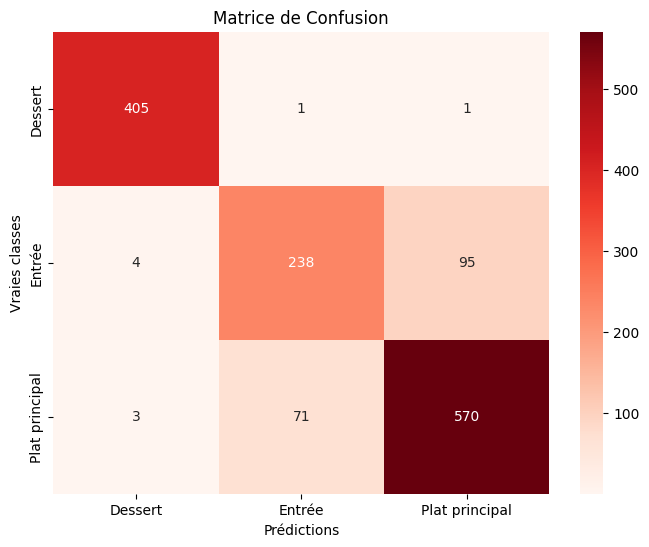
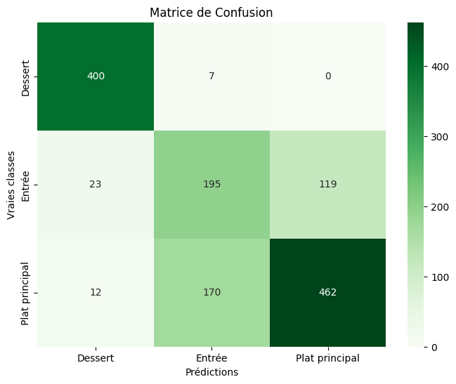

# DEFT2013 Tâche 2 : HiTALru NaTALmura & TALnus TArLsen

RIOLE Remy - CALLET Elliot

## Description de la tâche

L'objectif est de prédire le type d'un plat à partir d'informations telles que la recette, le titre, ou encore les ingrédients. Il s'agit d'une tâche de classification. Voici un exemple de donnée avec lesquels nous travaillons : 

| doc_id             | titre                  | type   | difficulte            | cout  | ingredients                                                     | recette                                          |
|--------------------|------------------------|--------|-----------------------|-------|-----------------------------------------------------------------|--------------------------------------------------|
| recette_217204.xml | Crêpes au canard laqué | Entrée | Moyennement difficile | Moyen | - 90 g de farine - 45 g de maïzena [...] - 9 cl de sauce hoisin | Couper finement le blanc [...] une salade verte. |

## Statistiques corpus

### Nombre de document de train/test

| Train | Test |
|-------|------|
| 12473 | 1388 |

### Répartitions des types de plats dans le corpus d'entrainement :

| Type de plat       | Nombre de documents | Pourcentage |
|--------------------|---------------------|-------------|
| Plat principal     | 5802                | 46.5%       |
| Dessert            | 3762                | 30.1%       |
| Entrée             | 2909                | 23.4%       |

### Répartitions des types de plats dans le corpus de test :

| Type de plat       | Nombre de documents | Pourcentage |
|--------------------|---------------------|-------------|
| Plat principal     | 644                 | 46.4%       |
| Dessert            | 407                 | 29.3%       |
| Entrée             | 337                 | 24.3%       |

## Méthodes proposées

### Methode 1 : Baseline (méthode de référence)

  - Nous avons choisi de simplement prédire la classe majoritaire. Dans notre cas, il s'agit de la classe "Plat principal", qui représente environ 47% de notre corpus d'entrainement. Nous n'utilisons donc pas de descripteur particulier, ni de classifieur.

### Methode 2 : SVC Tf-Idf - corpus global

 - Nous avons choisi d'utiliser un classifieur SVC (Support Vector Classifier) avec un descripteur Tf-Idf, sur le corpus global (concatenation des recettes, des titres, des ingrédients, de la difficulté et des couts). Nous avons utilisé les paramètres par défaut de la librairie scikit-learn.

### Methode 3 : Logistic Regression Tf-Idf - corpus global

 - Nous avons choisi d'utiliser un classifieur Logistic Regression avec un descripteur Tf-Idf, sur le corpus global.

### Methode 4 : Gaussian Naive Bayes Word2Vec - corpus global

- Nous avons choisi d'utiliser un classifieur Gaussian Naive Bayes avec un descripteur Word2Vec, sur le corpus global.

## Résultats

| Run                           | f1 Score |
|-------------------------------|----------|
| Baseline                      | 0.46     |
| SVC Tf-Idf                    | 0.87     |
| Logistic Regression Tf-Idf    | 0.88     |
| Gaussian Naive Bayes Word2Vec | 0.76     |

### Analyse de résultats

- La méthode de référence (Baseline) donne un score de 0.46, ce qui est relativement faible. Cela signifie que prédire la classe majoritaire n'est pas une bonne stratégie pour cette tâche.
- Les méthodes SVC Tf-Idf et Logistic Regression Tf-Idf donnent des scores de 0.87 et 0.88 respectivement. Ces scores sont très élevés, ce qui signifie que ces méthodes sont très performantes pour cette tâche.
- La méthode Gaussian Naive Bayes Word2Vec donne un score de 0.76, ce qui est moins bon que les deux premières méthodes. Cela signifie que cette méthode est moins performante pour cette tâche.
- En conclusion, les méthodes SVC Tf-Idf et Logistic Regression Tf-Idf sont les plus performantes pour cette tâche. Elles donnent des scores très élevés, ce qui signifie qu'elles sont très performantes pour prédire le type de plat à partir des informations disponibles.

## Pistes d'analyse:

### **Y-a-t-il des régularités dans les documents bien/mal classifiés ?**

On remarque qu'il y a 99% de précision sur la prédiction des desserts, là où les entrées sont moins bien prédites.
Cela s'explique sûrement par le fait que les entrées sont souvent caractérisées par certains ingrédients tels que le sucre ou la farine, et que les recettes contiennent aussi souvent des cuissons au four, ce qui constitue un pattern permettant de facilement les classer

### Matrice de confusion

#### Regression Logistique Tf-Idf

#### SVC Tf-Idf

#### Gaussian Naive Bayes Word2Vec

#### Conclusion

Grâces à ces matrices de confusion, on voit clairement que les modèles, même moins bons, sont très performants sur la classe "dessert", et que les erreurs arrivent dans la classification des entrées et plats principaux. 
On voit notamment que la régression logistique à plus tendance à prédire des plats principaux, là ou le SVC à un légèrement plus de prédictions de desserts. On voit finalement sur la matrice de confusion du Gaussian Naive Bayes prédit énormément de plat principaux comme des entrées.

* Combien de documents ont un score de 0 ? de 0.5 ? de 1 ? (Courbe ROC)
